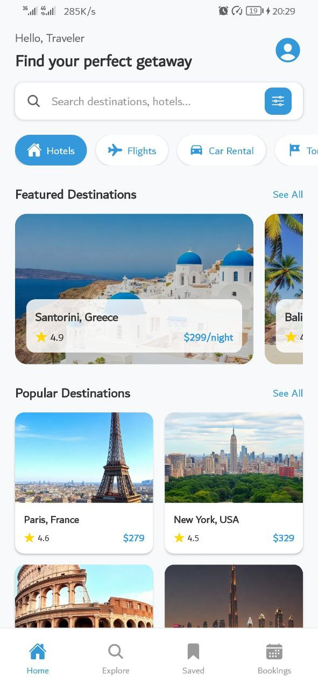
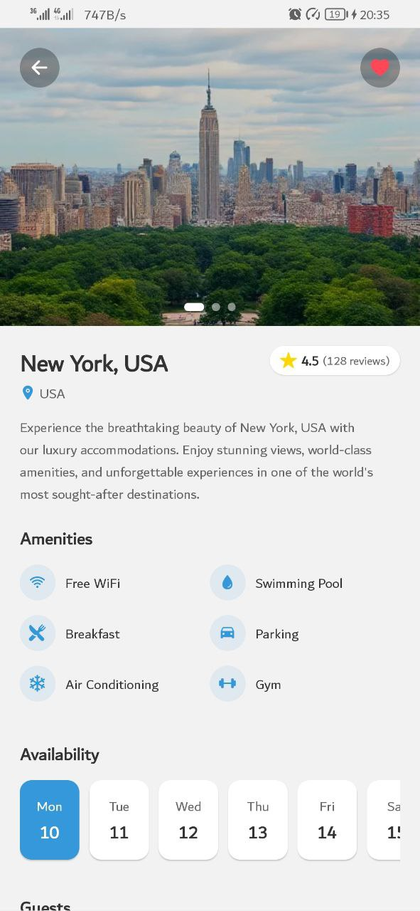
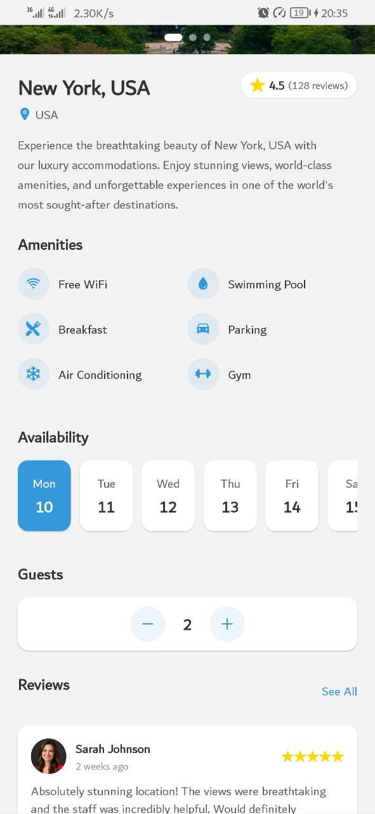
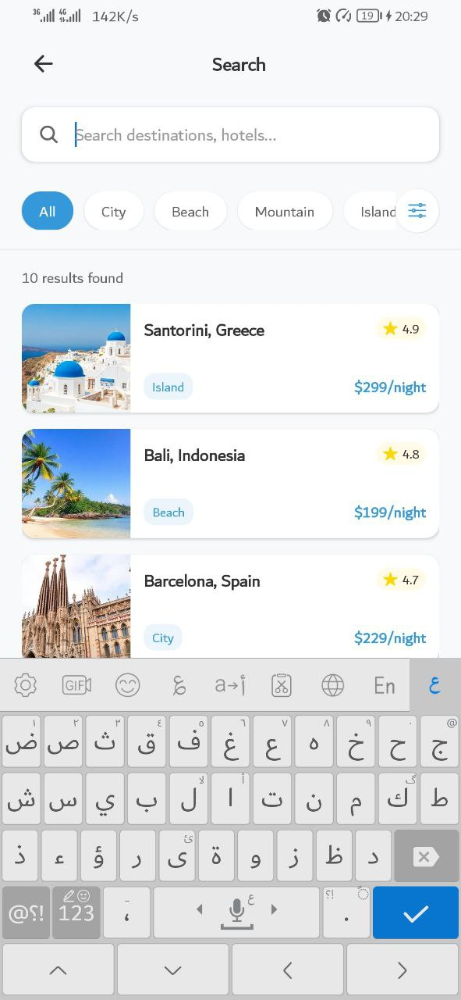

This is a React Native app built with **Expo** for booking travel services such as flights and hotels.

---

## 📦 1. Clone the Repository

```bash
git clone https://github.com/hsain9357/booking-app-react-native
cd booking-app-react-native
npm install
npm start
```
## Screenshots



##



##



##


##


##




This app is demo app.
